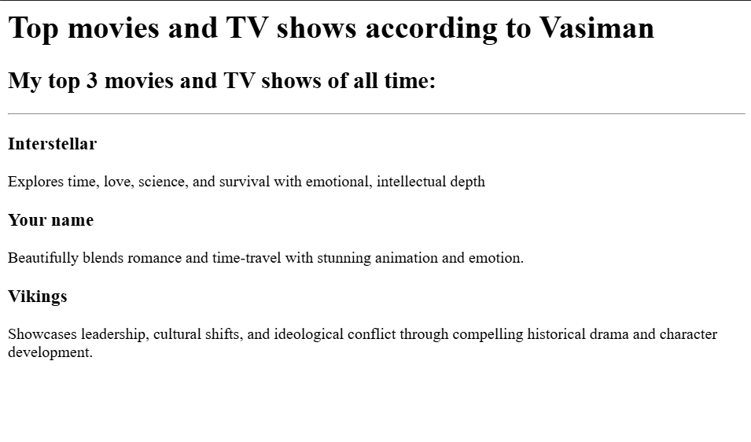

# 🎬 Movie Ranking Project

This is my first HTML project — built as part of Angela Yu’s Web Development Bootcamp.

## 🛠️ What I Learned
- How to use semantic HTML
- Headings (`<h1>` to `<h3>`), paragraphs (`
`)
- Basic webpage structure and line breaks

## 🖼️ Screenshot

## 📁 Files
- `index.html` – HTML file with content
- `image.png` – Screenshot of the result

